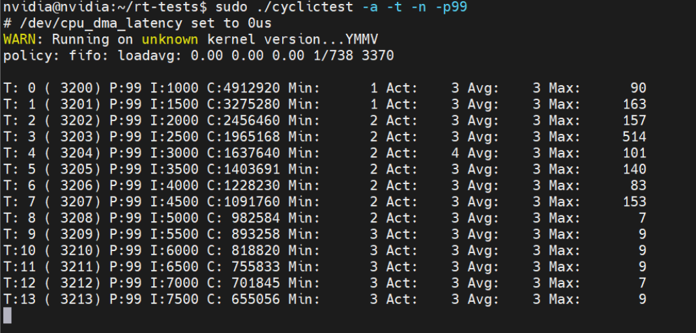
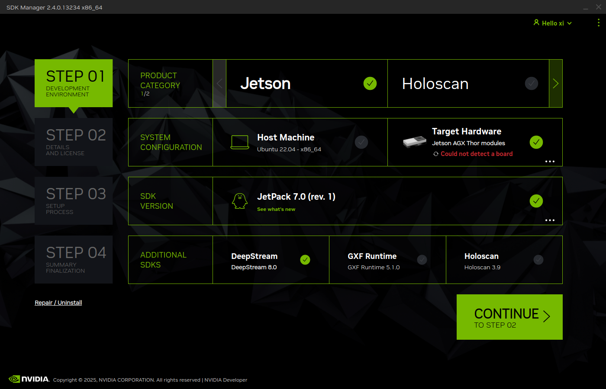
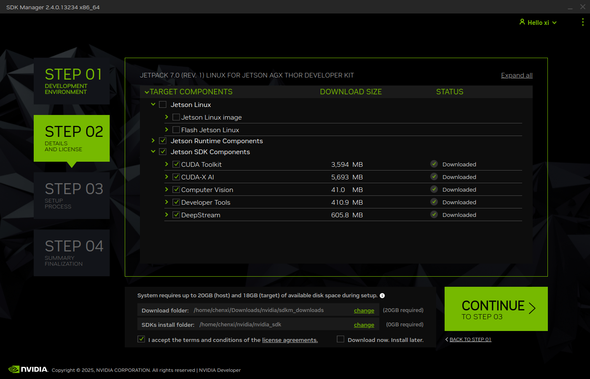

#### Introduction
This warehouse was established by Beijing Pinli Technology Co., Ltd. (hereinafter referred to as "our company"). This software is compatible with the carrier board (Y-C28) independently developed by our company, and is equipped with the board-level support package of the NVIDIA Jetson Thor series module. On the basis of NVIDIA Jetson™ Linux for Tegra, additional carrier board interface drivers have been added. This facilitates customers in developing their own systems and building other Jetson systems.

#### Hardware Support
- Y-C28-DEV(With NVIDIA AGX Thor T5000 Module);
- Y-C28-DEV(With NVIDIA AGX Thor T4000 Module); [The current L4T version does not support.]
- [28F1E4 IPC (standard configuration)](http://www.plink-ai.com/cn/product/product-28F1.html);
- 28F1 IPC with  **SFP+**  function;
- 28F1E4(With NVIDIA AGX Thor T400 Module，Supports 4-channel CAN bus); [The current L4T version does not support.]

#### Precondition
- A separate Linux (Ubuntu 22.04 or Ubuntu 20.04) host system.
- USB Type-A to USB Type-C cable (supporting data transmission);

#### Usage
To set up the flashing environment and perform the flashing operation on the Y-C28 board equipped with the Jetson AGX Thor series module, please refer to the following link:

[Y-C28_AGX-Thor_Flash_Step_CN](./doc/Y-C28_AGX-Thor_Flash_Step.md)

[Y-C28_AGX-Thor_Flash_Step_EN](./doc/Y-C28_AGX-Thor_Flash_Step_EN.md)

After the flashing process is completed and you enter the system of Jetson AGX Thor, please first execute the following command to ensure that the system kernel is no longer updated:
Depending on the specific kernel usage situation, you can choose one of them to execute:

- General Kernel

```
sudo apt-get update
sudo apt-mark hold nvidia-l4t-kernel-dtbs nvidia-l4t-kernel-oot-headers nvidia-l4t-kernel-oot-modules nvidia-l4t-kernel-openrm nvidia-l4t-bootloader-utils nvidia-l4t-bootloader nvidia-l4t-display-kernel
```
Install Kernel header file:

```
sudo apt-mark hold nvidia-l4t-kernel nvidia-l4t-kernel-headers
```


- Real-time Kernel
```
sudo apt-get update
sudo apt-mark hold nvidia-l4t-rt-kernel-dtbs nvidia-l4t-rt-kernel-oot-headers nvidia-l4t-rt-kernel-oot-modules nvidia-l4t-rt-kernel-openrm nvidia-l4t-rt-bootloader-utils nvidia-l4t-rt-bootloader nvidia-l4t-rt-display-kernel 
```

Install Real-time Kernel header file:

```
sudo apt-mark hold nvidia-l4t-rt-kernel nvidia-l4t-rt-kernel-headers
```


#### **Notes** ：
- The following commands related to the kernel startup are executed in the system of Jetson AGX Thor;
-  **The Y-C28 and its series of complete machines are prohibited from executing the command "sudo apt-get upgrade"; this command will cause a mismatch in the underlying drivers, thereby affecting the use of the carrier board interface.** 
- The following software can be installed according to your actual needs.
- If you need to switch to another software source, please make a backup of the default software source.

#### Enable the real-time kernel for Jetson AGX Thor (optional)
**Note**: The real-time kernel can be enabled only after a real-time kernel has been built before performing the flashing operation.

1. Modify the parameters of the startup file
    - File Path: /boot/extlinux/extlinux.conf;
    - Remove `efi=runtime` from the kernel boot parameters.
    - Add the following to the kernel boot parameters. Here, CPUs 8–13 are isolated for the real-time application; adjust based on your application:
```
rcu_nocb_poll rcu_nocbs=8-13 nohz=on nohz_full=8-13 kthread_cpus=0,1,2,3,4,5,6,7 irqaffinity=0,1,2,3,4,5,6,7 isolcpus=managed_irq,domain,8-13
```
Demo:
- Before Modify：
```
TIMEOUT 30
DEFAULT primary

MENU TITLE L4T boot options

LABEL primary
      MENU LABEL primary kernel
      LINUX /boot/Image
      FDT /boot/plink/y-c28-agx-thor-382-t5000.dtb
      INITRD /boot/initrd
      APPEND ${cbootargs} root=PARTUUID=5b6194ea-aa76-4087-a138-449369947861 rw rootwait rootfstype=ext4 mminit_loglevel=4 earlycon=tegra_utc,mmio32,0xc5a0000 console=ttyUTC0,115200 clk_ignore_unused firmware_class.path=/etc/firmware fbcon=map:0 efi=runtime
```
- After Modify：
```
TIMEOUT 30
DEFAULT real-time

MENU TITLE L4T boot options

LABEL primary
      MENU LABEL real-time kernel
      LINUX /boot/Image
      FDT /boot/plink/y-c28-agx-thor-382-t5000.dtb
      INITRD /boot/initrd
      APPEND ${cbootargs} root=PARTUUID=5b6194ea-aa76-4087-a138-449369947861 rw rootwait rootfstype=ext4 mminit_loglevel=4 earlycon=tegra_utc,mmio32,0xc5a0000 console=ttyUTC0,115200 clk_ignore_unused firmware_class.path=/etc/firmware fbcon=map:0 rcu_nocb_poll rcu_nocbs=8-13 nohz=on nohz_full=8-13 kthread_cpus=0,1,2,3,4,5,6,7 irqaffinity=0,1,2,3,4,5,6,7 isolcpus=managed_irq,domain,8-13
```
Just adjust the parameters according to the actual application.

2. Restart the system, apply the real-time kernel, and execute the following commands:
- Disable real-time task CPU time throttling:
```
sudo sysctl kernel.sched_rt_runtime_us=-1
echo -1 | sudo tee /proc/sys/kernel/sched_rt_runtime_us
```
- Disable real-time CPU runtime throttling:
```
sudo sysctl kernel.timer_migration=0
echo 0 | sudo tee /proc/sys/kernel/timer_migration
```
3. Test real-time kernel
```
git clone https://github.com/ScotSalmon/rt-tests.git
cd rt-tests/
make
sudo ./cyclictest -a -t -n -p99
```
The test results after 2 hours are shown in the following figure:



#### Install the necessary software for Jetson AGX Thor
- Supported software versions: [Link](https://developer.nvidia.com/embedded/jetpack/downloads)
- Make sure that Jetson Thor is connected to the internet.

1. Install Jetpack 
Due to the new L4T system (R38.\*/Jetpack7.*), when installing the Jetpack software package on the Jetson system, the underlying drivers will be upgraded and the startup files will be modified, which may cause abnormal interface driver of the carrier board or prevent the system from starting. Therefore, it is necessary to install the software on the Linux host using SDKmanager. The detailed operation steps can be referred to the following link.
- [Download and install SDKmanager](https://developer.nvidia.com/sdk-manager)
- [Login in and run SDKmanager](https://docs.nvidia.com/sdk-manager/download-run-sdkm/index.html#log-in-and-run-sdk-manager)
- [Using SDKmanager install jetpack](https://docs.nvidia.com/sdk-manager/install-with-sdkm-jetson/index.html#install-jetson-software-with-sdk-manager)

- When installing the Jetpack software using SDKManage, Jetson Thor does not need to enter the Recovery mode.
- During installation, it is necessary to ensure that the host and Jetson Thor are on the same local network.
- A USB Type-A to USB Type-C cable can be used to connect the FP interface (J2) of Y-C28 (which is perpendicular to the USB Type-C interface on the PCB board) to the USB Type-A interface of the host. The installation can be carried out via the IP address 192.168.55.1.
- During installation, select the following in STEP 01 (Deepstream software will decide whether to select based on the requirements; it is not a mandatory option):



- During installation, for STEP 02, please check the following: **It is particularly important to note that Jetson Linux should not be selected**:



After that, follow [Install Jetpack software using SDKManage](https://docs.nvidia.com/sdk-manager/install-with-sdkm-jetson/index.html#step-03-installation) to continue the installation.

2. Install Jtop tool: [reference linking](https://forums.developer.nvidia.com/t/a-method-to-install-jtop-on-thor-without-break-system-packages/344099)

3. Install Deepstream: [reference linking](https://docs.nvidia.com/metropolis/deepstream/dev-guide/text/DS_Installation.html#jetson-setup)
If you have selected "Deepstream" during the "Installing Jetpack" process, then in the following steps, only the dependencies need to be installed.
3.1 Install prerequisite packages
```
$ sudo apt install \
libssl3 \
libssl-dev \
libgstreamer1.0-0 \
gstreamer1.0-tools \
gstreamer1.0-plugins-good \
gstreamer1.0-plugins-bad \
gstreamer1.0-plugins-ugly \
gstreamer1.0-libav \
libgstreamer-plugins-base1.0-dev \
libgstrtspserver-1.0-0 \
libjansson4 \
libyaml-cpp-dev \
libmosquitto1
```
3.2 Install librdkafka (to enable Kafka protocol adaptor for message broker)
3.2.1 Install confluent-platform

```
$ sudo mkdir -p /etc/apt/keyrings

$ wget -qO - https://packages.confluent.io/deb/8.0/archive.key | gpg \
--dearmor | sudo tee /etc/apt/keyrings/confluent.gpg > /dev/null

CP_DIST=$(lsb_release -cs)
echo "Types: deb
URIs: https://packages.confluent.io/deb/8.0
Suites: stable
Components: main
Architectures: $(dpkg --print-architecture)
Signed-by: /etc/apt/keyrings/confluent.gpg

Types: deb
URIs: https://packages.confluent.io/clients/deb/
Suites: ${CP_DIST}
Components: main
Architectures: $(dpkg --print-architecture)
Signed-By: /etc/apt/keyrings/confluent.gpg" | sudo tee /etc/apt/sources.list.d/confluent-platform.sources > /dev/null

$ sudo apt-get update && sudo apt-get install confluent-platform
```
3.2.2 Install librdkafka

```
sudo apt-get install librdkafka-dev
```
3.3 Install Deepstream

```
$ wget --content-disposition 'https://api.ngc.nvidia.com/v2/resources/org/nvidia/deepstream/8.0/files?redirect=true&path=deepstream-8.0_8.0.0-1_arm64.deb' --output-document 'deepstream-8.0_8.0.0-1_arm64.deb'
$ sudo apt-get install ./deepstream-8.0_8.0.0-1_arm64.deb
```

####  Participation Contribution

- During the usage process, if you encounter any issues with flashing the device, please directly send an email to the following relevant contact person's email address:
    - Chen Xi: cx@plink-ai.com
    - Yang Chi: yc@plink-ai.com
    - Fu Huilin: fhl@plink-ai.com
- In order to resolve the problem you are facing as soon as possible, please include the following information in the email:
```
1.Please provide the product model and L4T version that you are using, and describe the specific problem in detail.
2.If the system burning process fails, please provide a screenshot of the failure.
```

#### Contact us

- **Beijing HO Address**: C1108, JinyuJiahua Plaza, Shangdi 3rd Street, Haidian District, Beijing, China
    - TEL: 400-127-3302
- **Tianjin BO address**: Room 903, Building 1, Science Park, Xinhua International University, No.1 Huixue Road, Jingwu Town, Xiqing District, Tianjin, China
    - TEL: 183-3100-3677
- **Chengdu BO address**: Room 1409, 14th Floor, No. 4111 Zizhou Avenue, Shuangliu High-tech Zone, Chengdu, Sichuan Province
    - TEL: 139-8046-2045
- **Jiangsu BO address**: A905-906, No. 18 Changwu Middle Rd, Wujin District, Changzhou City, Jiangsu Province, China 
    - TEL: 138-1382-5203
